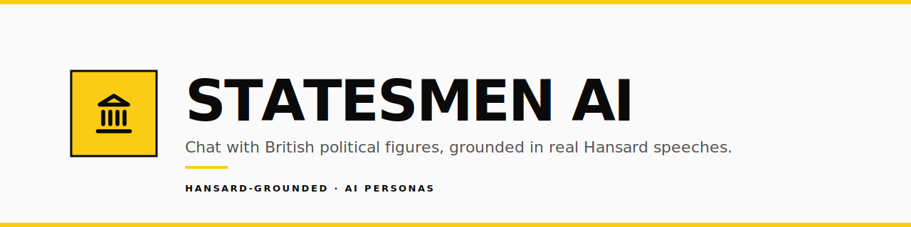

<div align="center">



**Chat with AI personas of British political figures — past and present —
built on demand from their real recorded speeches in Hansard.**

[](https://nextjs.org/)
[](https://react.dev/)
[](https://www.typescriptlang.org/)
[](https://tailwindcss.com/)
[](https://vercel.com)

[](https://openrouter.ai)
[](https://groq.com)
[](https://sdk.vercel.ai)
[](https://ui.shadcn.com)
[](https://hansard.parliament.uk)
[](#)

</div>

---

## ✦ What it does

Pick a Prime Minister, MP, or Lord — past or present — and have a conversation
with an AI version of them grounded in their actual recorded speeches from the
official **Hansard** record of the UK Parliament.

- **Browse** a curated grid of historical and modern figures, or **search 5,000+ members** from the live Members API
- Click *Chat with X* — the persona is built on demand from real speech data
- First-build is cached, so future visitors get **instant chat**
- **Era-locked**: Churchill politely refuses to discuss TikTok

## ✦ How it works

```
Homepage  →  Profile  →  click "Chat with X"
                                 │
                  status check ──┴── cache miss ──▶  Build pipeline (60-120s)
                                 │                          │
                          cache hit                    SSE stream
                                 │                          │
                                 ▼                          ▼
                              Chat ◀──────────────── /chat/{slug}
```

### The build pipeline (cold path, runs once per persona)

1. **Fetch** — pull the figure's contributions from Hansard
   - Modern PMs: server-side filter by `memberId`
   - Historical figures: client-side filter by `AttributedTo` + date range, with parallel topic queries
2. **Chunk** — token-aware split into ~8k pieces (`cl100k_base`), with a hard-slice fallback for oversized single sentences
3. **Extract** — N parallel LLM calls extract style, vocabulary, rhetorical devices, and verbatim examples per chunk
4. **Merge** — reduce N chunk extractions into one consolidated persona
5. **Render** — write Markdown system prompt + JSON examples bank
6. **Cache** — Vercel Blob in production, filesystem in dev

### Runtime chat

User message → `/api/chat` → server loads persona's `.md` + 8 randomly-sampled
verbatim quotes → builds the system prompt → streams Groq Llama in the persona's
voice via the Vercel AI SDK.

## ✦ Tech stack

| Layer | Choice |
|---|---|
| Framework | Next.js 16 (App Router, Turbopack) |
| UI | React 19 · Tailwind CSS v4 · shadcn/ui · Lucide |
| Streaming chat | Vercel AI SDK v6 (`useChat`, `streamText`) |
| LLM (offline build) | OpenRouter — fallback chain across 5 free models |
| LLM (chat) | Groq — Llama 3.3 70B / 3.1 8B Instant |
| Validation | Zod schemas on every external API response |
| Storage | Vercel Blob (prod) · filesystem (dev) |
| Data sources | UK Parliament Members API + Hansard API (no key required) |
| Tokeniser | `js-tiktoken` (cl100k_base) |

### Multi-model failover

Free OpenRouter models are 1 RPM each per upstream provider. The pipeline tries
each model in `OPENROUTER_MODELS` in order; on `429`, parse error, or
`"Provider returned error"`, it rolls forward to the next model. Five different
upstream providers gives **~5 RPM cumulative** with one API key.

```
OPENROUTER_MODELS = nemotron, qwen3, gpt-oss, gemma-4, minimax-m2.5
                    ↓ Nvidia   ↓ Venice ↓ OpenAI ↓ Google ↓ MiniMax
                    ───────────────────────────────────────────────
                    5 independent rate-limit pools
```

## ✦ Getting started

```bash
git clone https://github.com/pradhankukiran/statesmen-ai
cd statesmen-ai
npm install
cp .env.example .env.local          # then fill in your keys
npm run dev                          # localhost:3000
```

### Environment variables

| Variable | Required | Purpose |
|---|---|---|
| `OPENROUTER_API_KEY` | ✅ | Persona build (extract + merge calls) |
| `GROQ_API_KEY` | ✅ | Streaming chat |
| `OPENROUTER_MODELS` | recommended | Comma-separated fallback model list |
| `OPENROUTER_EXTRACT_MODELS` | optional | Override extract stage only |
| `OPENROUTER_MERGE_MODELS` | optional | Override merge stage only |
| `GROQ_CHAT_MODEL` | optional | Single chat model id |
| `BLOB_READ_WRITE_TOKEN` | prod only | Vercel Blob (auto-injected when you create a Blob store) |

Get keys: [OpenRouter](https://openrouter.ai/keys) · [Groq](https://console.groq.com/keys)

### CLI scripts

```bash
npm run script:fetch                  # smoke-test Hansard + Members APIs
npm run script:extract                # chunk + run one extraction call
npm run script:build                  # full pipeline for Boris Johnson
npm run script:build -- --thatcher    # historical (attribution-mode) build
```

## ✦ Project structure

```
statesmen-ai/
├── app/
│   ├── page.tsx                  # homepage: hero + search + popular grid
│   ├── p/[id]/                   # profile (numeric id or slug)
│   ├── build/[slug]/             # SSE build progress page
│   ├── chat/[slug]/              # streaming chat
│   └── api/
│       ├── persons/{search,[id]}
│       ├── persona/{status,build}
│       └── chat
├── components/
│   ├── ui/                       # shadcn primitives (Base UI under the hood)
│   ├── chat-window.tsx           # useChat + memoised markdown bubble
│   ├── build-progress.tsx        # SSE consumer with live progress
│   ├── chat-cta.tsx              # status-check + route to chat or build
│   ├── search-bar.tsx            # debounced + abort-controlled search
│   ├── person-card.tsx
│   ├── person-grid.tsx
│   └── site-{header,footer}.tsx
├── lib/
│   ├── persona.ts                # build orchestrator + renderers
│   ├── extractor.ts              # per-chunk LLM extraction
│   ├── merger.ts                 # consolidate N chunks → 1 persona
│   ├── chunker.ts                # token-aware splitter
│   ├── cache.ts                  # Blob + FS dual backend
│   ├── hansard.ts                # Hansard API client
│   ├── members.ts                # Members API client
│   ├── models.ts                 # model fallback resolution
│   ├── popular.ts                # popular-pms registry loader
│   ├── slug.ts                   # name → cache key
│   └── prompts/{extract,merge}.ts
├── data/popular-pms.json         # curated featured figures
└── scripts/                      # CLI smoke tests
```

## ✦ Design language

**Minimal shadcn × hint of neo-brutalism, single yellow accent.**

- Sharp `rounded-md` edges; `rounded-none` only for brand pills
- `border-2` everywhere a border reads
- Brand yellow rationed: focus rings, primary CTAs, hero pills, accent stripes
- Confident type — `text-5xl` to `text-7xl` headlines, `text-base` to `text-lg` body
- Generous whitespace, no shadow circus, no gradients

## ✦ Deploy

1. Push the repo to GitHub
2. Import the project on [Vercel](https://vercel.com/new)
3. Paste the env vars from your `.env.local`
4. Storage tab → **Create Blob store** → connect to project → done

The Blob token is injected automatically; no copy-paste needed.

## ✦ Acknowledgements

- **[UK Parliament Hansard](https://hansard.parliament.uk)** — open access to the official record
- **[UK Parliament Members API](https://members-api.parliament.uk)** — member metadata + portraits
- **[OpenRouter](https://openrouter.ai)** + **[Groq](https://groq.com)** — LLM inference
- **[Vercel AI SDK](https://sdk.vercel.ai)**, **[shadcn/ui](https://ui.shadcn.com)**, **[Lucide](https://lucide.dev)** — building blocks

## ✦ Disclaimer

Statesmen AI generates conversational AI personas from real public speeches.
**Responses are AI-generated and do not represent actual statements** by the
people depicted. This is a personal engineering project, not a journalistic or
political tool.

---

<div align="center">

Built as a personal project · powered by free-tier infrastructure · open to fork

</div>
